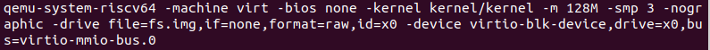
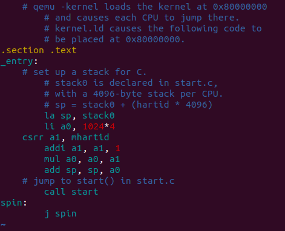
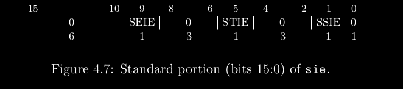

## the start of xv6

If we type "make qemu" in the xv6-lab-2020 directory, we may found the following ouput:
<div align="center"></div>

The meaning of the parameter:  
-kernel kernel/kernel  file to be run in qemu   
-m      128m           RAM capacity of the qemu virtual machine  
-smp    3              the number of the CPU cores that qemu can use  
-drive  fs.img         disk image that qemu use

### the relationship between risc-v, qemu and xv6
First of all, risv-v is an ISA (instruction set architecture), just like x86 or ARM, and it is open source. An ISA is not hardware, it is an interface between hardware and software, although you can hear some terms like RISC-V Mainboard, or something like that.

Qemu is a virtual machine,  a small virtual computer running in our physical computer, so we have to configure qemu, just like what the above parameters do. 
By the way, a virtual machine is not a real physical machine, and it is just software, mostly c code. So we can use software to do hardware's job. That's the main idea of Structured Computer Organization written by Tanenbaum.

xv6 is an operating system, written by RISC-V assembly and C code, which runs in qemu.

### loader

According to the file kernel.ld, kernel.ld file ensures that entry.S / \_entry is at 0x80000000, but I don't understand how it works. It is a question to be answered.<font color=yellow> #TO BE DONE </font>

### the routine of start
Machine mode, abbreviated as M-mode, is the most privileged mode. The most important feature of machine code is to intercept and handle exceptions.

#### machine mode
1. Start from entry.S.
<div align="center"></div>
According to the file, the main role of entry.S is to set up a stock for c, and jump to start.c.  
I use gdb to track how the code works, and I found mhartid is 0, so "sp = stack0 + 4096". And that's exactly what the comment says, with a 4096 byte stack per CPU.

2. start.c
```
void
start()
{
  // set M Previous Privilege mode to Supervisor, for mret.
  unsigned long x = r_mstatus();
  x &= ~MSTATUS_MPP_MASK;
  x |= MSTATUS_MPP_S;
  w_mstatus(x);

  // set M Exception Program Counter to main, for mret.
  // requires gcc -mcmodel=medany
  w_mepc((uint64)main);

  // disable paging for now.
  w_satp(0);

  // delegate all interrupts and exceptions to supervisor mode.
  w_medeleg(0xffff);
  w_mideleg(0xffff);
  w_sie(r_sie() | SIE_SEIE | SIE_STIE | SIE_SSIE);

  // ask for clock interrupts.
  timerinit();

  // keep each CPU's hartid in its tp register, for cpuid().
  int id = r_mhartid();
  w_tp(id);

  // switch to supervisor mode and jump to main().
  asm volatile("mret");
}

```
&emsp; &emsp;2.1) set M-mode to supervisor mode by writing the MPP bits of mstatus register.  
&emsp;&emsp;2.2) set M Exception PC to main, and the mepc register holds the address where the exception occurs.  
&emsp;&emsp;2.3) disable paging by writing 0 to satp register.  
&emsp;&emsp;2.4) delegate all interrupts and exceptions to supervisor mode. see riscv-privleged.pdf:30 for details about medeleg and mideleg register.  
&emsp;&emsp;And I couldn't understand what it means right now. <font color=yellow>#TO BE DONE </font>  
<div align="center"></div>
&emsp;&emsp;&emsp;&emsp;SIE is a supervisor interrupt register, and it is a R/W register containing the three interrupt enable bits. 
&emsp;&emsp;That is, externel, timer and software interrupt. See kernel/riscv.h:78.    

&emsp;&emsp;2.5) clock interrupts. <font color=yellow>#TO BE DONE </font>  
&emsp;&emsp;2.6) <font color=yellow> #TO BE DONE </font>  
&emsp;&emsp;2.7) mhartid register holds a integer ID of the hardware thread running the code. And we need to write the value into tp(x4) register. I don't know what the tp/x4 register means here. <font color=yellow>#TO BE DONE</font>  
&emsp;&emsp;2.8) after excuting the last instruction in start function, we switch to supervisor mode.  
&emsp;&emsp;mepc do a couple of things:  *from The RISC-V READER p104*  
&emsp;&emsp;&emsp;&emsp;2.8.1 mret set the PC to mepc    
&emsp;&emsp;&emsp;&emsp;2.8.2 restore the previous interrupt-enable setting by copying the mstatus MPIE field to MIE. MPIE bit stores the interrupt-enable status before trap.  
&emsp;&emsp;&emsp;&emsp;2.8.3 set the privilege mode to the value mstatus MPP bits.

#### Supervisor mode
To my suprise, compared with user mode, the supervisor mode can do only two more thing:
1. read & write the contrl register.  
&emsp;&emsp; SATP register  (Supervisor Address Translation and Protection)  
&emsp;&emsp; STVEC register (Supervisor Trap Vector Base Address Register)  
&emsp;&emsp; SEPC register  (Supervisor Exception Program Counter)  
&emsp;&emsp; SSCRATCH       (Supervisor Scratch Register)

2. use PTE whose PTE\_U equals 0

1. main.c 


